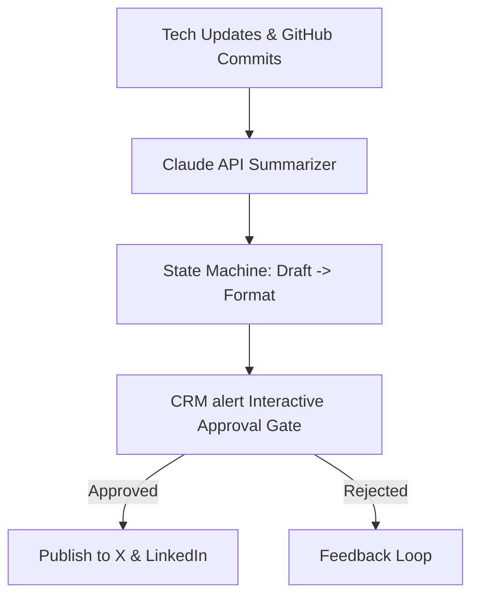

> **Short answer:** I built an automated social content agent for Heurist AI that ingested technical updates, summarized them using Claude API, and routed draft posts to a CRM alert channel with interactive 1-click approval buttons before publishing to X and LinkedIn.

## Context

Heurist AI is a decentralized AI cloud platform. The primary challenge was maintaining consistent, authoritative technical engagement across social media channels without hiring a dedicated editorial team or risking brand embarrassment through unvetted AI output.

## The system

## How I built it

1. **State Machine Logic**: Structured workflows inside n8n with deterministic states (`DRAFTED`, `FORMATTED`, `AWAITING_REVIEW`, `APPROVED`, `DISPATCHED`).
2. **Error Recovery & Circuit Breakers**: Built retry loops with exponential backoff for LLM rate limits and API timeouts.
3. **Interactive Approval Gate**: Dispatched formatted previews with 1-click Approve/Edit/Reject buttons into a dedicated CRM alert channel.
4. **Distribution Automation**: Routed approved payloads to X API and LinkedIn marketing endpoints with native media attachments.

## Results

- Maintained regular top-of-funnel technical presence across X and LinkedIn without a dedicated content department.
- Designed agent workflows with resilient state-machine logic, retries, and comprehensive error handling.
- Ensured 100% of outbound social posts passed through human editorial verification before publishing.

[See the underlying workflow: Waterfall Enrichment](/workflows/waterfall-enrichment)

[Hire me for this motion](/hire)
