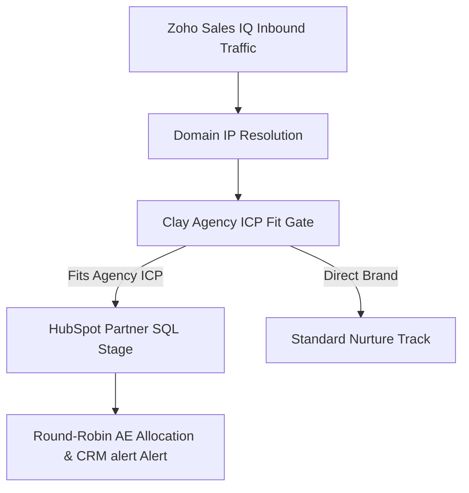

> **Short answer:** At Mavlers, I built a signal-based inbound and outbound engine using Zoho Sales IQ, Clay, and HubSpot. The system captured high-intent site traffic, filtered for agency firmographics, enriched decision-makers, and routed qualified accounts directly to account executives.

## Context

Mavlers provides white-label digital delivery (SEO, PPC, and AEO) exclusively to other agencies. The primary GTM challenge was separating end-client retail brand inquiries from high-value agency partners who needed white-label fulfillment capacity at scale.

## The system

## How I built it

1. **Multi-Signal Intent Capture**: Deployed Sales IQ tracking across key white-label service pages and pricing calculators.
2. **Deterministic ICP Filtering**: Programmed enrichment logic in Clay to filter out direct brands, isolating marketing, digital, and media agencies with 10–200 employees.
3. **HubSpot Architecture**: Mapped intent scores directly into HubSpot lifecycle stages, eliminating manual SDR qualification overhead.
4. **ICP Workshop & Offer Expansion**: Led an internal ICP workshop with executive leadership that formed the blueprint for an automated delivery add-on package.

## Results

- Owned the inbound-to-outbound transition end to end: visitors were flagged, scored against agency ICP criteria, and pushed into active sales sequences within HubSpot.
- Created alignment across sales and delivery teams using standard MQL → SQL transitions that sales representatives trusted.
- Delivered the technical foundation for a new automation service vertical built on top of existing white-label retainers.

[See the underlying workflow: Website Visitors to HubSpot](/workflows/website-visitors-to-hubspot)

[Hire me for this motion](/hire)
