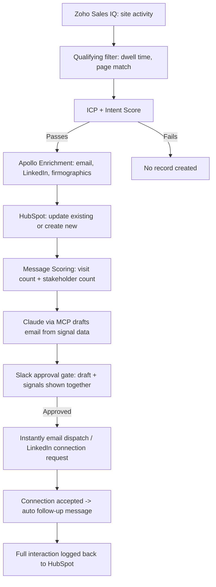

Mavlers · Role: **GTM Automation Lead & AI Search/SEO Lead (AEO/GEO)** · Apr 2026 – Sep 2026

# Mavlers: Partner Agency Signal-to-Revenue Engine

> **Short answer:** Mavlers was getting real buyer intent on their site and losing almost all of it. I built a signal-based system that turned anonymous visits into enriched, scored, personally-written outbound — sent automatically, approved by a human — while also building the automation layer behind the agency's SEO/AEO delivery, so inbound visibility and outbound pipeline ran as one connected system instead of two disconnected functions. Result: 3–4x more qualified leads from traffic that was already there, and double the open rate.

## Context

Mavlers sells white-label SEO, PPC, and AEO delivery to other agencies — not to end brands. That distinction matters: the GTM problem wasn't "get more traffic," it was "figure out which of the visitors we already have are agencies worth pursuing, and reach them before the moment passes." Before this system, every visitor looked the same on the backend — a retail brand poking around and a 150-person agency evaluating a white-label partner got the identical (or no) follow-up. Site activity was happening constantly and going nowhere.

## The revenue problem, plainly

Every day a real buying signal sat unused was pipeline Mavlers was quietly leaving on the table. A prospective partner agency would land on a service page, spend real time comparing offerings, maybe come back a second time — and then leave, because nothing on the backend knew that had happened. By the time that same account eventually filled out a form (if they ever did), they'd often already shortlisted a competitor. The cost wasn't visible in any dashboard; it just showed up as a smaller pipeline than the traffic numbers should have produced.

## The system

## How I built it

1. **Multi-signal capture.** Deployed Zoho Sales IQ across every white-label service page and the pricing calculator, tracking time on page, pages viewed, and whether a visitor came back.
2. **Deterministic filtering before spend.** Built a qualifying gate — minimum dwell time, at least one service-page view — so enrichment credits were never wasted on low-intent traffic. This is the step that keeps the whole system cheap enough to run continuously.
3. **Dual scoring, not one.** A fit score (agency, 10–200 employees, matches ICP) and an intent score (what they looked at, how long, how often) both had to clear threshold — high intent from the wrong company, or right-fit companies just browsing, never made it through alone.
4. **Waterfall enrichment via Apollo.** Qualified accounts were resolved to real contacts — email, LinkedIn, firmographics — connected directly to Apollo, built to be swappable for any enrichment stack a client already runs.
5. **HubSpot as the system of record.** Every qualified account was checked against HubSpot first: existing leads got updated with the new signal data, new ones got created — nothing was double-touched or dropped.
6. **A second scoring pass, purely for the message.** Separate from qualification, this pass decided *how* the email should read: a single-visit prospect got different copy than a repeat, multi-page visitor, and multi-stakeholder accounts were bumped to priority.
7. **Claude drafted the actual email via MCP**, using the exact signals — pages viewed, time spent, visit count — as the input, then posted the draft alongside those signals to Slack for a human approval gate before anything went out.
8. **Dispatch and closed-loop logging.** Approved messages went to Instantly for email or into LinkedIn as a connection request; an accepted LinkedIn connection auto-fired a follow-up and the entire interaction history logged back to HubSpot.
9. **ICP workshop → new offer.** Ran an internal ICP workshop with leadership that became the blueprint for a new, automated delivery add-on service, and packaged a GTM audit standard — covering top-of-funnel acquisition through MQL→SQL conversion — used to diagnose and sell that offer using the same funnel language sales already trusted.

*The full technical build — filter thresholds, the dual-scoring logic, the exact Claude/MCP prompt structure, and where this kind of system tends to break in production — is documented as a standalone, agency-agnostic workflow: [Website Signal-to-Outbound Engine →](/workflows/website-signal-to-outbound-engine)*

## Beyond outbound: building the systems behind SEO and AI search delivery

The outbound engine solved acquisition. But Mavlers also needed the SEO/AEO/GEO delivery itself to run as a system, not as a set of individually-run projects — and that's the part of the mandate that sits closest to how I actually work: as an SEO/AI search lead who builds the infrastructure underneath the strategy, not just the strategy on top of it.

**The problem before I got there.** Delivery quality depended entirely on which person happened to be assigned an account. Research was done manually per project, briefs varied in depth and structure account to account, QA was inconsistent, and — critically — nobody had a standing way to know whether any of the work Mavlers shipped was actually getting cited by ChatGPT, Perplexity, or Google AI Overviews. Citation checking, when it happened at all, was a one-off manual spot-check, not a metric anyone tracked over time. That's a real gap for an agency selling AEO/GEO as a service: you can't credibly sell AI-search visibility if you can't show your own visibility data on demand.

**What I built.** I designed and shipped the n8n-based automation layer behind the team's actual delivery pipeline — research intake → content brief → QA → publish gate — replacing ad hoc, person-dependent steps with one repeatable path every account moved through. That pipeline is wired directly into the tools the work already depends on:

- **Ahrefs and Semrush** feed keyword research, competitive gap analysis, and difficulty scoring straight into the brief stage automatically, instead of an analyst pulling reports by hand for every new piece.
- **ChatGPT** is queried as part of the pipeline itself — running the prompt-testing that checks whether a client's brand and content are actually surfacing in AI answers, not just ranking in Google.
- **A standing citation-tracking layer** monitors mentions across ChatGPT, Perplexity, and Google AI Overviews and rolls them into an AI-visibility index — turning "are we getting cited" from a question someone asks occasionally into a number the team reports on every cycle.
- **A packaged AEO audit standard** came out of the same system — schema, entity SEO, citation readiness, content structure — that Mavlers now uses as a credibility asset to win new white-label agency partnerships, rather than building a bespoke diagnostic for every new conversation.

**Why this matters for how I'd fit a role.** Most SEO/AEO specialists stop at strategy — keyword targeting, content structure, schema recommendations — and hand off distribution and pipeline to someone else. Most GTM/outbound engineers stop at the signal-to-CRM system and treat organic and AI-search visibility as somebody else's channel. I built both halves at the same company, at the same time, wired to the same underlying discipline: capture a signal (a site visit or a ranking/citation gap), score it, and act on it systematically instead of case-by-case. That's the actual fit — not "SEO person who also knows automation" or "GTM engineer who also knows SEO," but someone who runs inbound visibility and outbound pipeline as one connected growth system, because in practice they feed each other: the content that earns an AI citation is often the same page the outbound engine is trying to get a prospect to visit.

**The standardization work itself.** Beyond the tooling, I owned defining the process end to end: how a topic moves from research to brief to QA to publish, what "done" means at each gate, and how the team hands work between stages without losing context. That's the part that actually scales — automation without a standardized process just automates inconsistency faster.

## Results

- 3–4x more qualified leads surfaced from website traffic that was previously invisible on the backend.
- Roughly doubled email open rates once outbound reflected actual visitor behavior instead of generic copy.
- A standardized SEO/AEO delivery pipeline — research, briefing, QA, and publish — that runs the same way regardless of who's assigned the account, with AI-citation visibility tracked as a standing metric for the first time.
- Two reusable diagnostics came out of the work — an AEO audit standard that's now a credibility asset in white-label partner conversations, and a GTM audit that diagnoses funnel health the same way sales already thinks about it — replacing bespoke pitches with a repeatable one.

[See the full technical workflow: Website Signal-to-Outbound Engine →](/workflows/website-signal-to-outbound-engine)

[Hire me for this motion](/hire)
