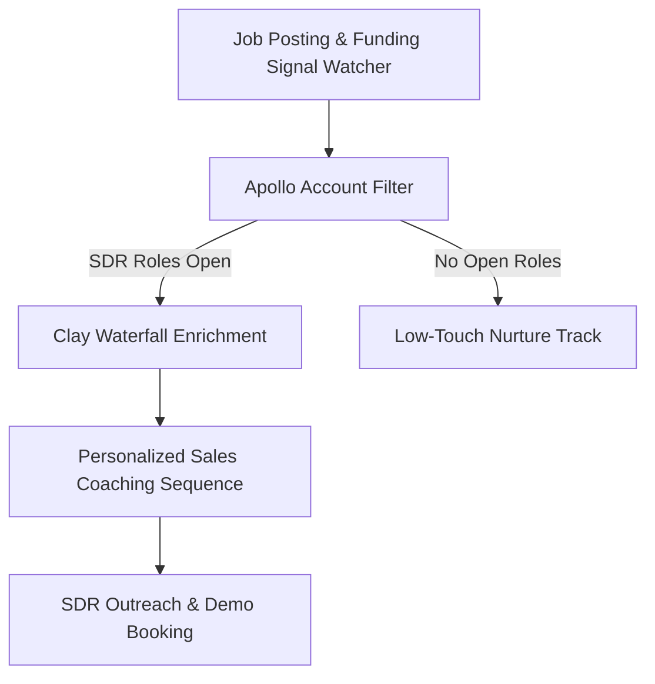

> **Short answer:** At Paddleboat AI, I engineered a signal-based outbound pipeline that monitored active SDR hiring posts and funding announcements, enriched decision-makers via waterfall lookups, and triggered personalized outreach playbooks.

## Context

Paddleboat AI provides an interactive AI sales coaching and roleplay platform. To maximize outbound efficiency, we needed to identify B2B SaaS companies at the exact moment they were aggressively hiring and scaling new SDR cohorts. Broad outbound campaigns suffered from low urgency when sent to companies not actively hiring.

## The system

## How I built it

1. **Multi-Signal Intent Engine**: Combined website intent data with external job board postings and funding alerts.
2. **ICP Difficulty Matrix**: Collaborated directly with founders and senior SDRs to structure rep personas based on buyer objection hardness, tech vertical, and deal complexity.
3. **LLM Scorecards & Missed Opportunity Alerts**: Configured automated scorecard summaries highlighting objection handling gaps during reps' practice calls.
4. **Pipeline Orchestration**: Aligned signal-driven data ingestion with sales outreach cadences to ensure SDRs contacted prospects while hiring context was fresh.

## Results

- Engineered an automated GTM system targeting VP and Head of Sales at 50–500 person SaaS organizations.
- Turned real sales representative feedback into modular product designs and objection templates.
- Built a signal-driven outbound engine that connected active hiring surges directly to sales meeting bookings.

[See the underlying workflow: Waterfall Enrichment](/workflows/waterfall-enrichment)

[Hire me for this motion](/hire)
