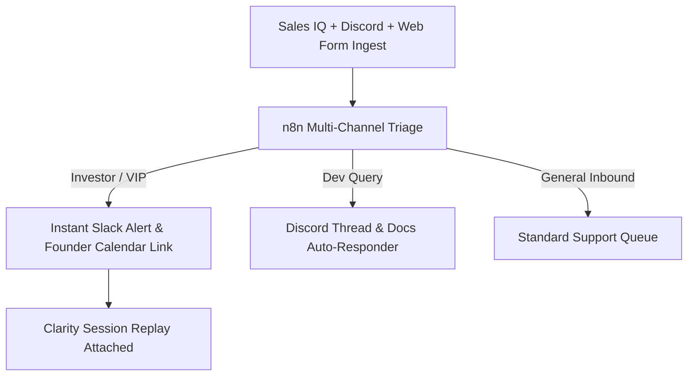

> **Short answer:** For Sonic, I built a founder-led GTM automation system that captured multi-channel intent signals across site visits, Discord, and forms, categorized inquiries, and alerted founders with session recordings for high-value leads.

## Context

Sonic required automated briefings for institutional partners and high-volume triage for community and developer inquiries. Inquiries arrived across social channels, Discord tickets, and forms. Without automated triage, key communications were delayed and support queues stalled.

## The system

## How I built it

1. **On-Site Signal Capture**: Integrated Zoho Sales IQ and Microsoft Clarity to track documentation reading depth and pricing inquiries.
2. **Founder Briefing Pipelines**: Built automated digest reports detailing high-intent institutional visitors, their company domain, and dwell time.
3. **Cross-Channel Support Triage**: Synchronized community questions into a unified workflow, isolating urgent technical issues from standard product questions.
4. **Funnel Friction Diagnosis**: Identified onboarding drop-off steps using Clarity heatmaps before sales or developer relations reps initiated outreach.

## Results

- Captured on-site signals with Sales IQ and routed them directly into priority conversion paths.
- Delivered real-time investor and partner briefings across channels and outbound email.
- Utilized analytics and session telemetry to resolve conversion friction prior to human engagement.

[See the underlying workflow: Website Visitors to HubSpot](/workflows/website-visitors-to-hubspot)

[Hire me for this motion](/hire)
