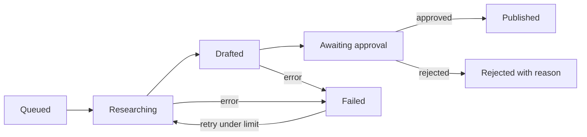

> **Short answer:** Agent workflows need state machines because real runs fail in the middle. Named statuses let you retry the failed step, skip work that already finished, and park output in an approval state before anything is published or sent.

Most first versions of a GTM agent are one script: fetch, prompt, format, post. That demo works. The second morning it posts twice, drops a batch, or sends a draft that never should have left the queue. The fix is not a smarter model. It is the same idea used in durable workflows from [Temporal](https://docs.temporal.io/workflows) and in error handling on [n8n](https://docs.n8n.io/flow-logic/error-handling/): every item has a status that lives outside the run.

## The problem with a linear agent script

A linear script has one memory: the process. If Claude, the [HubSpot API](https://developers.hubspot.com/docs/api/overview), Instantly, or X returns a 429, the whole run dies. You do not know which rows already published. Re-running the script is how teams burn domains and duplicate LinkedIn posts.

GTM makes this worse than a backend job:

- Side effects are public (email, social, CRM fields sales will act on).
- Providers rate-limit ([Apollo](https://docs.apollo.io/), [Clay](https://www.clay.com/university), HubSpot, LLM APIs).
- A human still has to approve copy. That pause is a state, not a sleep() in the script. See [human-in-the-loop GTM agents](https://tibinjacob.com/blog/human-in-the-loop-gtm-agents).

## What the machine looks like

Treat this as a finite-state machine: a finite set of statuses, explicit transitions, and no silent jumps. The same pattern shows up in order systems, payments, and [AWS Step Functions](https://docs.aws.amazon.com/step-functions/latest/dg/welcome.html). GTM agents are not special. They just have louder failure modes.

## Four rules I actually use

1. **State lives outside the run.** Postgres, a Notion database, HubSpot properties, or a sheet. If the worker dies, the next worker reads status. This is the same split Temporal makes between workflow history and the worker process.
2. **Steps are idempotent.** Before posting to LinkedIn or writing a lifecycle stage, re-read status. If it is already `published` or `mql`, skip. HubSpot associations and Instantly campaign enrollments are easy to double-fire if you do not check.
3. **Retry with a budget.** Transient 429/5xx: backoff and retry. After N attempts, `failed` and an alert. n8n documents this as Error Trigger plus retry settings; do not invent infinite loops.
4. **Approval is a state.** `awaiting_approval` is as real as `drafted`. Timeout must not auto-approve. That rule is how this site itself publishes: Notion Status moves Idea → Approved → Live; LinkedIn stays in Review until a human ticks it.

## States for a content or outbound agent

| State | Meaning | Next |
|---|---|---|
| queued | Source exists (new article, signal, reply) | researching |
| researching | Facts pulled from the source URL or CRM | drafted or failed |
| drafted | Copy + automated checks (length, banned phrases, missing source) | awaiting_approval |
| awaiting_approval | Human approve / edit / reject | published or rejected |
| published | Public URL stored | terminal |
| rejected | Reason stored for prompt work | terminal |
| failed | Step + attempt count stored | researching or terminal |

A crash in `researching` does not republish. A crash after Instantly accepts the API call must already have flipped `published`, or the next run will send again.

## How to implement it in n8n (no custom platform)

- One table: `item_id`, `state`, `attempts`, `last_error`, `payload_json`, timestamps.
- One workflow per transition: “research queued”, “draft researched”, “publish approved”.
- First node of each workflow: read state. If it moved, exit.
- On HTTP error: increment attempts; if under limit, stay/return to `failed` for a delayed retry; else alert Slack/email.
- Dead-letter the poison rows. Review them weekly the way you would a Bounce queue in Instantly or a failed workflow in n8n.

Make, Relay.app, and Temporal implement the same split. The tool is not the point. The named states are.

## Where I used this

At Heurist AI I designed content and outbound agents with retries, error handling, and a human gate so generation could run every day without a babysit. The write-up is in the [Heurist case study](https://tibinjacob.com/work/heurist-autopilot-agents). The same statuses run this site: Notion rows, Git commit, wait for `tibinjacob.com` 200, then a LinkedIn draft. Job A never posts socially. That is a different state.

Related: [what a GTM engineer actually builds](https://tibinjacob.com/blog/what-does-a-gtm-engineer-do), [visitor-to-SQL routing](https://tibinjacob.com/workflows/website-visitors-to-hubspot), [hire me](https://tibinjacob.com/hire).

## What to measure

- Time in `awaiting_approval` (review bottleneck).
- Approval rate without edits (prompt quality).
- Failures by step (usually one provider).
- Duplicate-send count (should be zero; if not, idempotency is broken).

## Common mistakes

- State in RAM or only in the n8n execution log.
- Retrying forever on a 400 that will never succeed.
- Twenty micro-states that should be one transition.
- No terminal states, so items sit in `drafted` for months.
- Auto-approve on timeout.

## FAQ

**What is a state machine in an AI agent workflow?**  
Each item has a defined status and moves through small, retryable steps instead of one script.

**Why do AI agents need retries?**  
Timeouts, rate limits, and bad model output are normal. Bounded retries absorb the temporary ones.

**How do you prevent double posts?**  
Check state before the side effect. Mark `published` only after the provider confirms.

**Can you do this in no-code tools?**  
Yes. n8n, Make, and HubSpot workflows can all branch on a stored status field.
