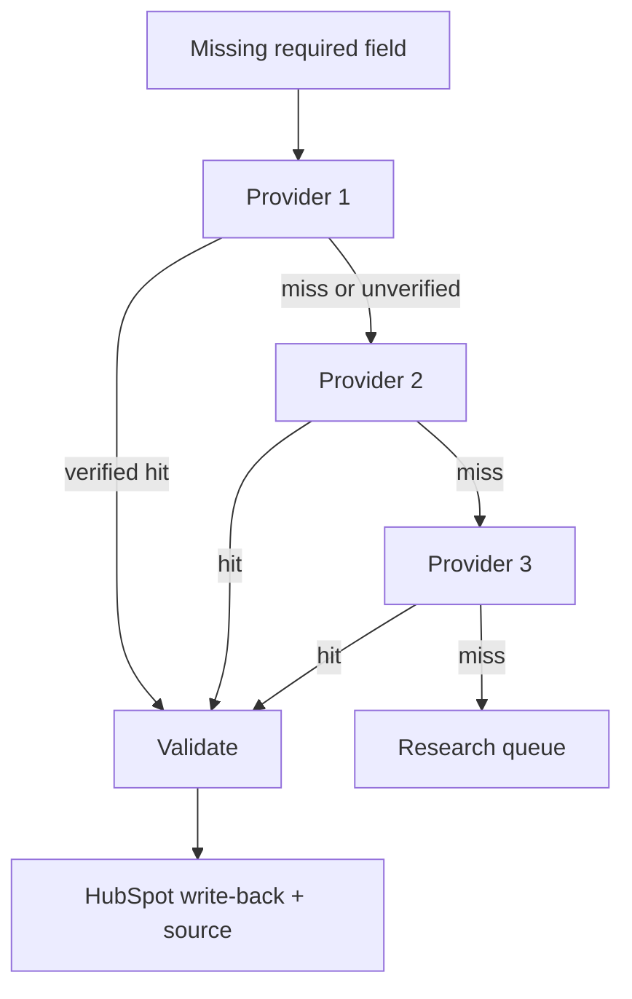

> **Short answer:** Waterfall enrichment asks providers one after another until a field is filled and verified. No vendor covers every region and title. Sequence + verification beats a single expensive subscription.

[Clay](https://www.clay.com/university) popularised the waterfall column. [Apollo](https://www.apollo.io/), [Hunter](https://hunter.io/), [Dropcontact](https://www.dropcontact.com/), [People Data Labs](https://www.peopledatalabs.com/), and Clearbit-style firmographics all miss different slices. US SaaS coverage is not EU agency coverage. A waterfall is how you stop paying three full seats for the same 40% match rate.

## Why one provider is a leak

Empty company size or work email means your [HubSpot lead score](https://tibinjacob.com/workflows/hubspot-lead-scoring) is fiction. SDRs then Google the account. That is the bottleneck the waterfall is meant to remove.

Order providers by **cost × expected hit rate for your ICP**, not by brand. Typical GTM order I use:

1. Fields already in HubSpot (free).
2. Clay native / table enrichment you already pay for.
3. Apollo people/org APIs.
4. A specialist for the miss pattern (Dropcontact for France, Hunter for domains, a phone vendor last).

Stop at the first **verified** value. Unverified hits still cost credits and still bounce.

## Flow

Trigger: contact or company created/updated in HubSpot, or a Clay workbook row with a null email/size/title. Orchestration can live in Clay waterfalls or in [n8n](https://docs.n8n.io/) when you need retries and a dead-letter that Clay columns do not give you.

## Steps

1. **Define required fields.** Work email, seniority, employee band, country. Everything else is optional.
2. **Skip if present and fresh.** Do not re-bill Apollo for a value written last week unless it failed verification.
3. **Call provider 1.** Persist provider name + raw payload + timestamp.
4. **Verify before write.** Email: syntax, MX, reject `info@` / `sales@` / disposable domains. Phone: E.164. Headcount: numeric band, not marketing copy.
5. **Fall through.** Only on miss, timeout, or failed verify.
6. **Write staging properties first.** `email_enriched`, `email_source`, `email_confidence`. Promote to the standard HubSpot email only after checks. This is the safe [CRM write-back](https://tibinjacob.com/glossary/crm-write-back) pattern.
7. **Circuit-break.** 429 from Apollo or Clay: backoff, do not burn the rest of the waterfall in a tight loop ([Apollo rate limits](https://docs.apollo.io/)).
8. **Conflicts.** Two vendors disagree → log both, do not silently overwrite a value a rep typed yesterday.

## Failure modes

- **Rate limit:** retry with jitter; park the row in `enrich_pending`.
- **No match:** `enrich_status = research`. High-priority ICP gets a task. Nobody gets a sequence.
- **Catch-all domain:** treat as low confidence. Keep out of Instantly / HubSpot sequences until a human or a second verifier agrees.
- **Duplicate contacts:** search HubSpot by email and domain before create. Same idea as the visitors workflow: [anonymous visitors → HubSpot](https://tibinjacob.com/workflows/website-visitors-to-hubspot).

## Stack

Clay (column waterfall + credits), Apollo (people/org), n8n (retries, Slack on exhausted rows), HubSpot (source properties + workflow enrollment gates).

Optional later: a cheap decision model on “is this email safe to send?” so you are not spending a full LLM on a boolean. Until then, rules + a verifier API are enough.

## Where I used this

At Paddleboat AI the job was accounts scaling an SDR team. Waterfall-filled size, industry, and contacts so scoring was not empty-field theatre. [Paddleboat case study](https://tibinjacob.com/work/paddleboat-sdr-scaling-signals). Same enrichment sits under the Mavlers partner-agency motion and the visitor-to-SQL path.

Also: [GTM engineer role](https://tibinjacob.com/blog/what-does-a-gtm-engineer-do) · [hire](https://tibinjacob.com/hire)

## FAQ

**What is waterfall enrichment?** Sequential provider calls until a verified value lands.

**Why cheapest first?** Premium APIs only on misses.

**What if all miss?** Research queue. Never outbound on nulls.

**Which tools?** Clay + Apollo + n8n + HubSpot. Swap vendors; keep verify + source + stop-on-hit.
