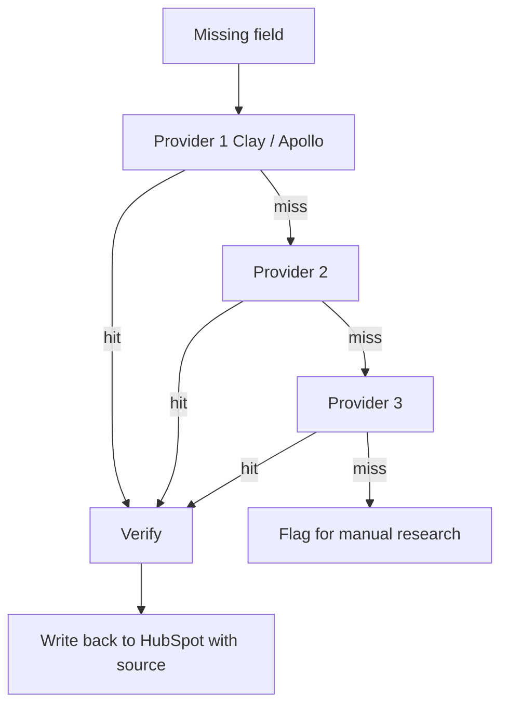

Short answer: Waterfall enrichment queries data providers in sequence until a field is filled with a verified value. No single provider covers every market, so a waterfall fills gaps while keeping cost under control.

## Why a single provider is not enough

Different data providers cover different markets, company sizes and regions. A provider strong on US SaaS may have thin coverage for European agencies or SMBs. Relying exclusively on a single vendor leaves significant coverage gaps across your target addressable market. When account executives or outbound automation engines attempt to process records with missing firmographic or contact data, conversion rates collapse and manual research bottlenecks emerge.

A waterfall queries providers in a fixed order — cheapest and best-fit first — and only moves to the next when the current provider returns nothing or an unverified value. This keeps costs down while maximising verified coverage. By establishing conditional logic between API calls, GTM teams eliminate redundant enrichment spend while ensuring that high-value prospects receive deep multi-source validation before entering active sales sequences.

## How the workflow runs

Each record enters the waterfall when a required field is missing. Providers are queried in order. The first that returns a verified value wins. If none match, the record is flagged for research rather than sent to outbound with empty data.

The system operates strictly on deterministic validation rules. When a domain or contact record is ingested, the pipeline first verifies whether required attributes like direct work email, job title, company headcount, or tech stack details already exist in the CRM. If any core field is null or unverified, the record triggers the cascading lookup sequence.

## Steps

1. **Trigger**. A new or updated record in HubSpot or Clay is missing a field the team needs — a work email, phone number, or company size. The waterfall starts automatically when the record is created or updated.

2. **Query the first provider**. The first provider is queried. It is chosen for low cost and good coverage for your specific market. If it returns a verified value, the waterfall stops here, saving API credits on the remaining providers.

3. **Fall back in order**. If the first provider returns nothing or an unverified value, the next provider is queried. This continues until a verified value is found or the list is exhausted.

4. **Verify**. Before the value is written anywhere it is checked — email format and domain validity for emails, format and sanity checks for other fields. Values that fail verification are not written.

5. **Write back with source**. The verified value is written to HubSpot with a field recording which provider it came from. Reps and reports always know the data's origin, and audits are straightforward when a value turns out to be wrong.

## Operational Logic and Data Integrity

Maintaining data hygiene requires strict separation between enriched fields and core CRM standard properties. The waterfall engine populates custom staging properties in HubSpot to allow automated verification protocols to validate data quality prior to updating primary CRM properties.

When validating contact emails, the pipeline executes syntax checks, domain MX record queries, and direct SMTP handshake verification. Disposable email domains, catch-all servers without strict mailbox confirmation, and role-based addresses (e.g., info@, sales@) are automatically tagged as low-confidence. They are routed to specialized research queues rather than active outbound campaigns to safeguard domain deliverability and sender reputation.

## When it fails

**Rate limits**. When a provider returns a rate-limit error, the request is retried after a short delay rather than dropped. The record stays pending until the retry succeeds or the maximum retry count is reached. Exponential backoff with randomized jitter prevents secondary API locks during high-volume batch runs.

**No match anywhere**. When every provider misses, the record is flagged and kept out of outbound sequences. A research task is created for high-priority accounts so the field can be filled manually. Keeping unverified records out of automated email cadences maintains list hygiene and prevents domain burn.

**Conflicting values**. When two providers return different values for the same field, the conflict is logged rather than silently resolved. A human reviews conflicting values before either is written to the CRM. This approach prevents overwriting reliable historical records with inaccurate external lookup results.

## Stack

Clay, Apollo, n8n and HubSpot.

## Where I used this

I used waterfall enrichment to fill firmographic and contact fields for accounts flagged by site-intent and growth signals at Paddleboat AI, where the goal was identifying companies scaling their SDR org. Enrichment made scoring reliable: you cannot score ICP fit when company-size and industry fields are empty.

[Read the Paddleboat AI case study](/work/paddleboat-sdr-scaling-signals)

[Hire me for this motion](/hire)

## Questions

**Q: What is waterfall enrichment?**
**A:** Waterfall enrichment queries several data providers in sequence until a field is filled with a verified value, instead of relying on one provider's coverage.

**Q: Why order providers by cost?**
**A:** Starting with the cheapest provider and only paying for premium lookups when earlier ones miss keeps costs down while coverage goes up.

**Q: What happens when every provider misses?**
**A:** The record is flagged for manual research or excluded from outbound, so reps never work unverified data.

**Q: Which tools do you use?**
**A:** Clay to orchestrate the waterfall, Apollo as the primary data source, n8n for automation, and HubSpot for CRM write-back.

