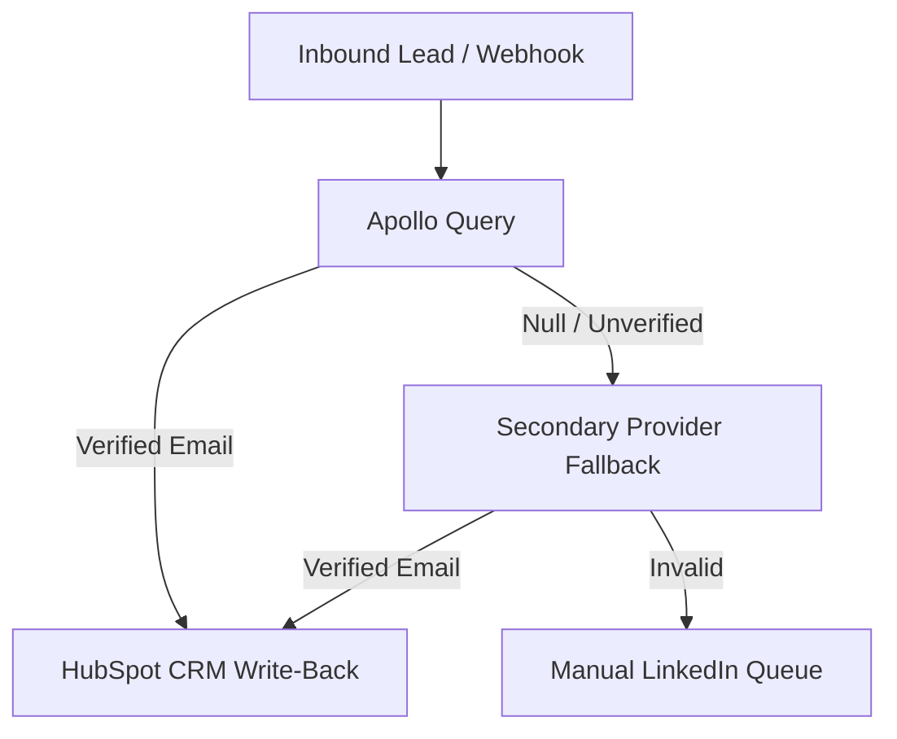

> **Short answer:** A waterfall enrichment pipeline is a deterministic sequence of data provider queries that triggers when an account or lead is ingested. Rather than relying on a single database, the engine queries a primary source (like Apollo), tests validity, and only cascades to secondary providers if the record is missing or unverified, before validating MX deliverability and writing to CRM.

## How the workflow runs

## Why Single-Provider Outbound Fails

Relying on one data provider leads to lost opportunities due to missing emails, and high bounce rates that burn outbound domains. A waterfall architecture treats data vendors as interchangeable APIs ordered by cost and match efficiency.

## Steps

1. **Ingestion & Domain Normalization**: Payload arrives from website visitor signals, CSV imports, or outbound scraping. Domain is sanitized to prevent duplicate lookups.
2. **Tier-1 Provider Query (Apollo)**: Query the primary provider. If a valid, high-confidence work email is returned, the record immediately jumps to MX validation.
3. **Tier-2 Provider Fallback**: If Tier-1 returns no record or an unverified email, the payload cascades to secondary vendors with higher coverage for specific geographies or titles.
4. **Deliverability & Catch-All Verification**: Perform DNS, MX record, and deep SMTP handshakes. Catch-all emails without strict mailbox confirmation are flagged as unverified and isolated from primary outreach.
5. **CRM Deduplication & Rep SLA Assignment**: Before creating or updating records, query HubSpot via API to check for existing owner assignments or open deals. Qualified contacts are synced with an SLA alert.

## When it fails

1. **API Rate Limiting (429s)**: Automated exponential backoff with jitter handles rate limits cleanly without dropping leads.
2. **Credit Exhaustion Guard**: If a provider returns insufficient credit error codes, the engine automatically notifies the Slack channel and skips to the subsequent tier without terminating the batch.
3. **Catch-All Isolation**: Emails flagged as risky or unverifiable are routed into a secondary research queue rather than cold email cadences.

## Stack

Clay · Apollo · n8n · HubSpot

## Where I used this

Implemented this waterfall structure for SDR intent signals at Paddleboat AI.

[See this in production: Paddleboat AI Case Study](/work/paddleboat-sdr-scaling-signals)

[Hire me for this motion](/hire)

## Frequently Asked Questions

- **What is the typical cost reduction achieved with waterfall enrichment?**
  By ordering providers from lowest cost-per-verified-lead to secondary fallbacks, overall enrichment costs drop while coverage expands.
- **How does this prevent polluting the CRM with bad data?**
  Deduplication checks run before write-back, and only emails with verified deliverability scores are stamped into active outreach fields.
