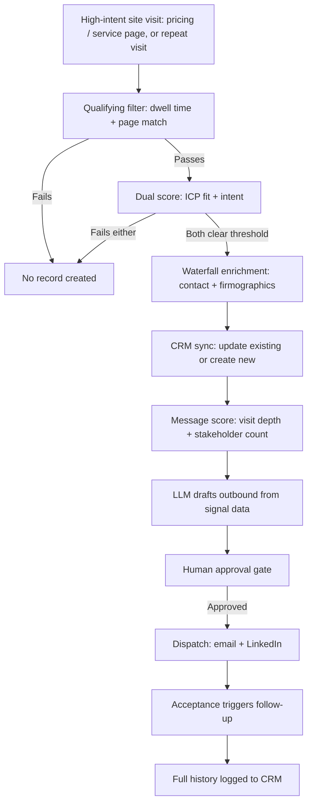

## Watch the breakdown

I walk through this exact system end to end in the video below — the signal capture, the scoring logic, the Claude/MCP drafting step, and the approval gate.

<div style="position: relative; padding-bottom: 53.75%; height: 0;"><iframe src="https://www.loom.com/embed/fc6b7f9cd75b415ca85cdac2949a6d45" frameborder="0" webkitallowfullscreen mozallowfullscreen allowfullscreen style="position: absolute; top: 0; left: 0; width: 100%; height: 100%;"></iframe></div>

On this page: [Short answer](#summary) · [How it works](#how-it-works) · [Architecture](#architecture) · [Deep dive](#deep-dive) · [FAQ](#faq)

## The short answer

Most of your B2B site traffic is buyers doing research anonymously, and almost none of it becomes pipeline. This workflow catches the accounts that show real intent, scores and enriches them, and writes outbound from what they actually did on your site — with a human still approving every message before it sends.

## Why this exists

You're already paying for the traffic. The pages are being read, the pricing calculator is being used, people are coming back for a second look — and by the time any of that shows up as a form-fill, if it ever does, the prospect has often already shortlisted someone else. The lost revenue here is invisible: it never appears as a bounced email or a missed call, it just shows up as a pipeline number that's smaller than the traffic numbers say it should be. This workflow exists to stop that leak.

## Architecture at a glance



---

## Deep dive

### For founders: why this is a revenue system, not a marketing tool

Think about what a single missed high-intent visit actually costs. A prospect who's already spent four minutes on your pricing page and come back a day later is not a cold lead — they're mid-evaluation. If nothing captures that moment, you don't just lose one email address; you lose the window where you're being actively compared against alternatives. Multiply that by every unrecognized repeat visitor in a month, and the gap between "traffic we generated" and "pipeline we generated" is where this system pays for itself.

The build cost is modest relative to what it protects: a site-intent tool, an enrichment provider, your existing CRM, and orchestration (n8n or similar) tying them together — most implementations are live in one to two weeks. There's no new headcount required; this sits underneath the SDR team, not instead of it, feeding them warmer, better-context conversations instead of cold lists. The ROI case is straightforward: if your average deal is worth even a few thousand dollars and this recovers a handful of previously-invisible accounts a month, it pays back its build cost inside the first quarter.

The build-vs-buy question usually comes down to control. Off-the-shelf visitor-identification tools will flag a company name; almost none of them will write a personalized message from the specific pages that person viewed, gate it through a human, and log the full loop back into your CRM. That's the part that's worth building custom, even if the identification layer itself is bought.

### For engineers: how it actually runs

**The trigger condition.** A pageview event on a defined high-intent page set (pricing, service pages, comparison pages) or a repeat session from a previously-seen IP/company match fires the workflow. A single blog read does not qualify — the trigger set should be narrow and deliberate.

**The qualifying filter (before any paid API call).** This is the step that keeps the system economical:

```javascript
// Pseudocode — qualifying gate before enrichment spend
function qualifies(visit) {
  if (visit.dwellSeconds < 20) return false;
  if (!visit.pagesViewed.some(p => HIGH_INTENT_PAGES.includes(p))) return false;
  if (KNOWN_BOT_ASNS.includes(visit.asn)) return false;
  return true;
}
```

Nothing downstream runs unless this passes — no enrichment call, no CRM write, no LLM invocation. This is what separates a system that scales cheaply from one that burns enrichment credits on noise.

**Dual scoring.** Fit and intent are computed and gated independently:

```javascript
const fitScore = scoreFirmographics(account); // headcount, industry, region
const intentScore = scoreBehavior(visit);      // pages, dwell time, visit count
const qualifies = fitScore >= FIT_THRESHOLD && intentScore >= INTENT_THRESHOLD;
```

Treating these as one blended score is the most common mistake here — it lets a high-intent competitor or student researcher through, or filters out a perfect-fit account that just hasn't spent enough time on-site yet.

**Enrichment waterfall.** Standard cascade: primary provider first, fallback provider on miss, with normalized output regardless of source:

```javascript
async function enrichAccount(domain) {
  let result = await apollo.enrich(domain);
  if (!result.email) result = await clay.enrich(domain);
  return normalizeContact(result);
}
```

**CRM sync logic.** Always check for an existing record before writing:

```javascript
const existing = await hubspot.findByDomain(account.domain);
if (existing) {
  await hubspot.updateContact(existing.id, { ...signalData, lastVisit: visit });
} else {
  await hubspot.createContact({ ...enrichedData, ...signalData });
}
```

**Message-scoring branch.** A single-visit account and a three-visit, two-stakeholder account should never receive the same email:

```javascript
const messageProfile = {
  tone: visit.visitCount > 1 ? 'warm-repeat' : 'first-touch',
  priority: account.stakeholderCount > 1 ? 'high' : 'standard'
};
```

**LLM draft + approval gate.** The prompt to the model should carry the raw signal, not a summary of it — exact pages, exact dwell time, exact visit count — since that specificity is what makes the resulting copy read as personal rather than templated. The draft and the signals it was built from are posted together into the approval channel; nothing dispatches without a human click.

**Dispatch and closed loop.** On approval, the message routes to an email-sending tool or a LinkedIn connection request. A LinkedIn acceptance is itself a trigger — it fires an automatic follow-up and writes the full sequence (visit → enrichment → score → message → response) back to the CRM as one continuous account history.

### Where it breaks in practice

| Failure mode | What happens | Mitigation |
|---|---|---|
| IP can't be resolved to a company (VPN, mobile, remote worker) | Visit is logged but never routed | No record created from unidentified traffic — this is correct behavior, not a bug, since it keeps the CRM free of unverified noise |
| Enrichment returns no contact | Account qualifies but has no one to email | Route to a manual-review queue instead of sending with placeholder data |
| Duplicate account across sessions | Risk of two records for one company | Domain-match check before every write; always update, never blind-insert |
| LLM drafts off-tone or factually wrong copy | Bad message could reach a real prospect | The Slack approval gate is non-negotiable — never wire this to auto-send |
| No routing rule matches a qualified account | Account sits unassigned | Fallback owner + alert, so nothing silently disappears |

### Tuning it after launch

Start the dwell-time and score thresholds deliberately conservative — better to under-qualify in week one than flood sales with noise. Watch reply rates by message-tone branch (first-touch vs. warm-repeat) and adjust the scoring cutoffs based on which segment actually converts, not which segment is largest. Revisit the high-intent page list quarterly; the pages that signal real evaluation intent shift as your product and pricing page evolve.

---

## Where I built this

I built this system for [Mavlers](/work/mavlers-partner-agency-signals), a white-label agency whose growth goal was landing more agency clients globally — not just more traffic. Their challenge wasn't visibility, it was that every visitor looked identical on the backend, whether it was a retail brand or a 150-person agency actively evaluating a white-label partner. This system gave them a way to tell the difference automatically, and to reach the ones that mattered with a message written from what that specific account had actually done — before a competitor got there first. The result was 3–4x more qualified leads from traffic they already had, and roughly double the open rate once messaging stopped being generic.

[Read the full Mavlers case study →](/work/mavlers-partner-agency-signals)

[Deploy this in your stack](/hire)
