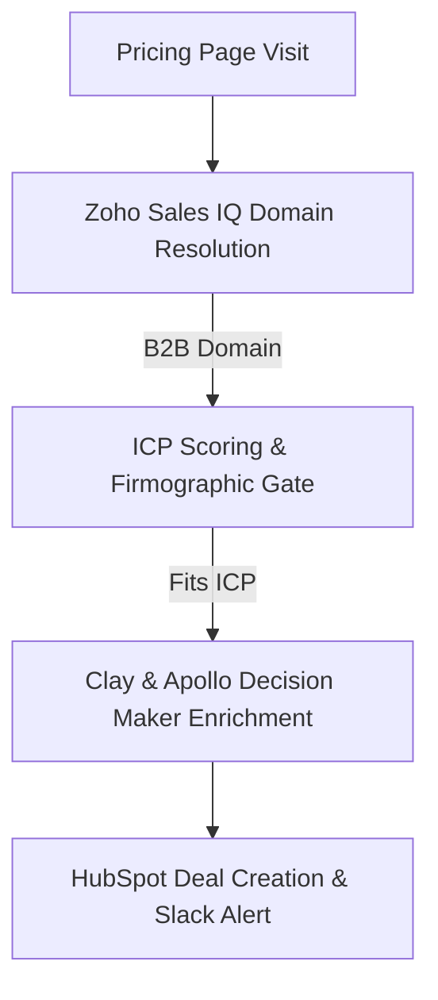

> **Short answer:** To turn anonymous website traffic into pipeline, capture session telemetry via tools like Zoho Sales IQ, filter out consumer ISPs to resolve corporate domains, evaluate the visit against strict ICP firmographic criteria, waterfall-enrich the relevant decision-makers, and automatically create a qualified lead or deal in HubSpot with a rep SLA alert.

## How the workflow runs

## The Lost Inbound Problem

Most qualified B2B website visitors never fill out a contact form. They evaluate your pricing, read your architecture documentation, and leave. Without automated intent capture, that buying intent vanishes.

## Steps

1. **Event Signal Filtering**: Collect real-time visit events using Zoho Sales IQ. Filter out bots, automated web scrapers, and consumer broadband providers to isolate legitimate B2B IP ranges.
2. **Session Telemetry & Intent Scoring**: Score engagement based on pages visited. A visit to the pricing page carries higher weight than a top-of-funnel blog post view.
3. **Account Firmographic Matching**: Cross-reference the resolved domain against company ICP parameters (e.g., headcount, vertical). Accounts failing criteria are logged quietly without alerting reps.
4. **Waterfall Decision-Maker Extraction**: If the account passes the ICP gate, automatically query Clay and Apollo to surface target decision-makers.
5. **HubSpot Pipeline Write-Back & Rep Notification**: Sync the account and contact records into HubSpot with an intent timestamp. Send a formatted Slack notification to the assigned AE containing session history and suggested talking points.

## When it fails

1. **Deduplication Conflicts**: If the account already has an active opportunity or recent sequence enrollment in HubSpot, the system appends the visit note to the existing record instead of creating duplicate leads.
2. **Missing Decision Maker Matches**: When no direct email match is found, the system routes the account to a research queue for manual LinkedIn verification.
3. **Rate Limits & After-Hours Signals**: Signals captured outside working hours are queued and dispatched at 8:30 AM local rep time to prevent missed SLAs.

## Stack

Zoho Sales IQ · Clay · Apollo · HubSpot · Slack

## Where I used this

Implemented this visitor identification and signal-routing engine at Mavlers.

[See this in production: Mavlers Case Study](/work/mavlers-partner-agency-signals)

[Hire me for this motion](/hire)

## Frequently Asked Questions

- **Is anonymous visitor tracking compliant with privacy regulations like GDPR?**
  Yes. Reverse IP lookup identifies corporate entities, not individual consumer personal data, keeping processing aligned with business-to-business privacy standards.
- **What speed-to-lead SLA should teams aim for with intent signals?**
  Inbound intent signals convert at their highest rate when reps initiate personalized outreach promptly following the session.
