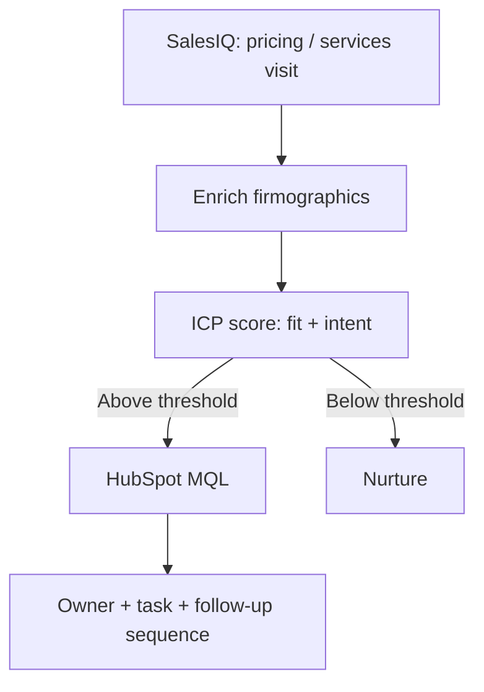

Short answer: Most B2B visitors leave without a form fill. This workflow catches high-intent visits at company level with Zoho SalesIQ, scores the visiting company against your ICP, and routes qualified accounts into HubSpot with an owner and a follow-up sequence.

## Why most B2B visitors never become leads

Most B2B buyers research vendors before they ever make contact. Those research visits happen anonymously: the visitor reads a pricing page or a case study and leaves. Relying strictly on traditional web form conversions means ignoring the vast majority of high-intent prospect behavior happening across your digital properties. By the time a buyer decides to request a demo or complete a form, they may already be far along in their evaluation process with a competitor.

A visitor identification workflow catches those accounts at company level, scores them, and sends qualified ones to sales so the research visit becomes a lead rather than a missed signal. By bridging the gap between website analytics and sales actionability, revenue teams turn passive traffic into timely, context-rich outbound conversations before prospect intent cools down.

## How the workflow runs

A visit to a high-intent page triggers the workflow. The account is enriched, scored, and routed if it clears the threshold. Accounts that do not qualify go to nurture rather than being dropped.

The system continuously monitors pageview events and session durations. When an IP match resolves to a corporate entity, the payload passes through firmographic filters to discard consumer ISPs, residential proxies, and existing customer networks before evaluating sales readiness.

## Steps

1. **Flag the visit**. Zoho SalesIQ identifies the company behind a visit and records which pages were viewed and when. Only visits to high-intent pages trigger the workflow: pricing, services, comparison pages and case studies. A single blog read is not enough to trigger routing.

2. **Enrich the account**. Before scoring, the company is enriched with firmographic data: industry, company size, region. Without enrichment, scoring is guesswork. This step uses the same waterfall approach as the waterfall enrichment workflow, querying Apollo and Clay sequentially.

3. **Score against the ICP**. The account receives two scores: a fit score based on firmographics, and an intent score based on which pages were viewed and how many times. Both scores are required to pass. High intent from a company that does not fit the ICP does not become an MQL.

4. **Set the lifecycle stage**. Accounts that clear both thresholds are moved to MQL in HubSpot using the lifecycle stage definitions sales already trusts. Using existing stages means sales knows what an MQL means and does not need to re-learn the process.

5. **Route and follow up**. The MQL is assigned to an owner by territory, segment or round robin. A task is created automatically and the account is enrolled in the right follow-up sequence with visit history and enriched data attached as context.

## Operational Logic and Routing Integrity

Lead routing rules must account for existing account ownership and deal stage status to avoid rep collision. When a visiting company is identified, n8n queries HubSpot to verify whether the domain already exists as an open opportunity or assigned target account.

If the account already belongs to an account executive, the new intent signals are appended directly to the account activity timeline, and an automated task is assigned to the current owner. If the account is net-new, round-robin rules distribute the MQL to an available rep along with decision-maker contact details obtained via waterfall enrichment.

## When it fails

**Company not identified**. When SalesIQ cannot match a visit to a company — common with remote workers, VPNs and mobile connections — the visit is logged but not routed. No record is created from an unidentified visit to avoid filling the CRM with unverified noise.

**Duplicate account**. When the visiting company already exists in HubSpot, the workflow matches to the existing record rather than creating a duplicate. If the account already has an owner it is routed to that owner along with the detailed visit history.

**No owner available**. When no routing rule matches, the account is sent to a default owner and an alert is created so it does not sit unassigned. The fallback queue ensures zero intent signals slip through the cracks.

## Stack

Zoho SalesIQ, n8n, Clay and HubSpot.

## Where I used this

This workflow was the core of the partner-agency motion at Mavlers. Sales IQ site intent was combined with firmographics and engagement data, scored against the partner-agency ICP, and routed into HubSpot through the MQL to SQL stages sales already trusted.

[Read the Mavlers case study](/work/mavlers-partner-agency-signals)

[Hire me for this motion](/hire)

## Questions

**Q: Can you identify anonymous website visitors?**
**A:** Tools like Zoho SalesIQ can identify the company behind many B2B visits, not the individual person. The workflow works at account level and finds the right contacts separately using waterfall enrichment.

**Q: Why score intent and fit together?**
**A:** Intent alone brings in students and competitors. Fit alone brings in accounts not in market. Combining both keeps sales focused on accounts that match the ICP and are active now.

**Q: What counts as a high-intent page?**
**A:** Pricing, services, comparison and case study pages, especially repeat visits from the same company. A single blog read is low intent.

**Q: What happens when no routing rule matches?**
**A:** The account goes to a fallback owner with an alert so nothing sits unassigned.

